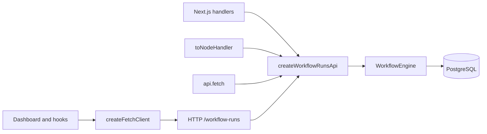

# @pg-workflows/ui

React dashboard and HTTP adapters for [pg-workflows](https://github.com/SokratisVidros/pg-workflows). Browse, monitor, and manage workflow runs, or build your own UI on the hooks.

---

## Try the dashboard

The fastest way to look at runs. Postgres and a `pg-workflows` process are already running; this command does not add React to that app.

```bash
npx @pg-workflows/ui
```

Open <http://127.0.0.1:3777>.

---

## Next.js

App Router is the default: one catch-all route serves the API, and a page renders `<WorkflowRunsDashboard/>`. A working copy lives in [`examples/dashboard`](../../examples/dashboard).

### Install

```bash
npm install @pg-workflows/ui @tanstack/react-query pg-workflows pg
```

Install `tailwindcss` as well when the app does not already use Tailwind v4.

### App Router

```ts
// lib/engine.ts
import { WorkflowEngine } from 'pg-workflows'
import { sendWelcome } from './workflows'

const globalForEngine = globalThis as unknown as {
  engine?: WorkflowEngine
}

export function getEngine() {
  if (!globalForEngine.engine) {
    const connectionString = process.env.DATABASE_URL
    if (!connectionString) throw new Error('DATABASE_URL is not set')
    globalForEngine.engine = new WorkflowEngine({
      connectionString,
      workflows: [sendWelcome],
    })
  }
  return globalForEngine.engine
}
```

```ts
// app/workflow-runs/[[...path]]/route.ts
import { createAppRouterHandler } from '@pg-workflows/ui/next'
import { getEngine } from '@/lib/engine'

// `getEngine` itself — not `getEngine()` — so the handler calls it on the first request, awaits `engine.start()`, and builds the run API once.
export const { GET, POST } = createAppRouterHandler({ engine: getEngine })
```

```tsx
// app/page.tsx — a Server Component is fine
import { WorkflowRunsDashboard } from '@pg-workflows/ui'

export default function Page() {
  return <WorkflowRunsDashboard baseUrl="/workflow-runs" />
}
```

### Pages Router

One optional catch-all. `basePath` is `/api/workflow-runs`, because that is the public URL Next puts on the request.

```ts
// pages/api/workflow-runs/[[...path]].ts
import { createPagesApiHandler } from '@pg-workflows/ui/next'
import { getEngine } from '@/lib/engine'

export default createPagesApiHandler({
  engine: getEngine,
  basePath: '/api/workflow-runs',
})
```

```tsx
<WorkflowRunsDashboard baseUrl="/api/workflow-runs" />
```

---

### Styles

The components are [Base UI](https://base-ui.com/react/components) parts with a default theme. Add the stylesheet once. [Styling & Customization](#styling--customization) covers recoloring and the Base UI style hooks (`className`, `style`, `render`).

In your global CSS:

```css
@import 'tailwindcss';
@import '@pg-workflows/ui/styles.css';

@source '../node_modules/@pg-workflows/ui/dist';
```

`styles.css` defines the `--pgw-*` variables (light and dark) and the `.pgw-root` base. `@source` is relative to this file. From `app/globals.css` or `src/index.css`, `../node_modules/@pg-workflows/ui/dist` is the package build. Tailwind then generates the utility classes the components use.

## Vite

Install the same packages and add the same [stylesheet](#styles) as Next.js. The client and hooks are plain React. Point the dashboard at an API you host with [Express](#express), [Hono](#hono), or any server below.

```css
@import 'tailwindcss';
@import '@pg-workflows/ui/styles.css';

@source '../node_modules/@pg-workflows/ui/dist';
```

```tsx
import { WorkflowRunsDashboard } from '@pg-workflows/ui'

export function App() {
  return <WorkflowRunsDashboard baseUrl="/workflow-runs" />
}
```

Proxy `/workflow-runs` to the API from the Vite dev server so the page and the API share an origin. The adapter does not send CORS headers. A `baseUrl` on another origin stays blocked in the browser until that server allows the page's origin.

---

## Express

`createWorkflowRunsApi` maps HTTP onto the engine (list, get, stats, cancel, pause, resume, fast-forward, trigger). It speaks Web `Request` / `Response`. `toNodeHandler` adapts that to Node `(req, res)` for Express, Fastify (`req.raw` / `reply.raw`), Nest, or raw `node:http`.

```ts
import express from 'express'
import { createWorkflowRunsApi, toNodeHandler } from '@pg-workflows/ui/server'
import { engine } from './engine'

const runsApi = createWorkflowRunsApi({
  engine,
  basePath: '/workflow-runs',
})

const app = express()
app.use('/workflow-runs', toNodeHandler(runsApi))
```

`basePath` has to match the mount. Express strips that prefix from `req.url` and keeps it on `req.originalUrl`, which is what `toNodeHandler` reads. Leave the body stream unread — `express.json()` on this path consumes it before the handler can.

Render the dashboard from [Next.js](#nextjs) or [Vite](#vite) with `baseUrl="/workflow-runs"`.

---

## Hono

Create the api the same way as in [Express](#express) (the default `basePath` is `/workflow-runs`), then forward the Fetch request:

```ts
import { Hono } from 'hono'
import { runsApi } from './runs-api'

const app = new Hono()

app.all('/workflow-runs', (c) => runsApi.fetch(c.req.raw))
app.all('/workflow-runs/*', (c) => runsApi.fetch(c.req.raw))
```

`toFetchHandler(runsApi)` is the same function if you already hold a wrapper that expects `(request) => Response`.

---

## TanStack Start

Server routes are `createFileRoute` handlers. The list path and the splat are different files: `/workflow-runs/$` matches `/workflow-runs/stats` and `/workflow-runs/:id/cancel`, and it does not match `GET /workflow-runs`.

```ts
// src/routes/workflow-runs.index.ts
import { createFileRoute } from '@tanstack/react-router'
import { runsApi } from '../lib/runs-api'

export const Route = createFileRoute('/workflow-runs')({
  server: {
    handlers: {
      GET: ({ request }) => runsApi.fetch(request),
    },
  },
})
```

```ts
// src/routes/workflow-runs/$.ts
import { createFileRoute } from '@tanstack/react-router'
import { runsApi } from '../../lib/runs-api'

const handle = ({ request }: { request: Request }) => runsApi.fetch(request)

export const Route = createFileRoute('/workflow-runs/$')({
  server: {
    handlers: {
      GET: handle,
      POST: handle,
    },
  },
})
```


---

## Bun

```ts
import { runsApi } from './runs-api'

Bun.serve({
  fetch(request) {
    return runsApi.fetch(request)
  },
})
```

This process serves the API. A request whose path is not under `basePath` (default `/workflow-runs`) gets a 404 from the adapter. Point the dashboard `baseUrl` at that prefix.

---

## Deno

```ts
import { runsApi } from './runs-api.ts'

Deno.serve((request) => runsApi.fetch(request))
```

Same API-only behavior as [Bun](#bun).

---

## Reference

### Architecture



The browser calls the hooks, the hooks call HTTP, and the server adapter calls `WorkflowEngine`. Postgres stays on the server.

### Entry points

Client code never imports the server entry, so a browser bundle does not pull in the engine.

| Import | Contents | Runs |
|--------|----------|------|
| `@pg-workflows/ui` | Dashboard, components, hooks, provider, and a re-export of the fetch client | client |
| `@pg-workflows/ui/client` | `createFetchClient` and types, no React | client or server |
| `@pg-workflows/ui/server` | `createWorkflowRunsApi`, `toFetchHandler`, `toNodeHandler` | server only |
| `@pg-workflows/ui/next` | `createAppRouterHandler`, `createPagesApiHandler`, `createRouteHandlers` | server only |
| `@pg-workflows/ui/tailwind` | Tailwind preset for the `pgw-*` color tokens | build |
| `@pg-workflows/ui/styles.css` | CSS variables (light and dark) and base styles | client |
| `pg-workflows-ui` (bin) | Standalone localhost dashboard — see [Try the dashboard](#try-the-dashboard) | CLI |

If you use a JS Tailwind config instead of `@source`, add the preset and the package to `content`:

```ts
import pgwPreset from '@pg-workflows/ui/tailwind'

export default {
  presets: [pgwPreset],
  content: ['./node_modules/@pg-workflows/ui/dist/**/*.js'],
}
```

Dark mode follows `prefers-color-scheme` on the `--pgw-*` variables. To recolor or restyle, see [Styling & Customization](#styling--customization).

### Dashboard

`<WorkflowRunsDashboard/>` is self-contained. Pass exactly one of `baseUrl` or `client`.

| Prop | Role |
|------|------|
| `baseUrl` | Prefix of the routes you mounted. Mutually exclusive with `client`. |
| `client` | A `WorkflowRunsClient`, usually from `createFetchClient`. Mutually exclusive with `baseUrl`. |
| `pollIntervalMs` | Live-refresh interval. Omitted, the Live control uses `5000` while on and `0` while off. Set it, and that value replaces the control: the button still toggles, but the interval does not. |
| `selectedRunId` | Controlled selection. Pair with `onSelectRun` and your router for a deep link. |
| `onSelectRun` | `(id: string \| null) => void` |
| `className`, `style`, `render` | Base UI style hooks. `className` and `style` may be a value or a function of `{ selected }`. `render` replaces the root element. |

### Hooks and components

Provide a client with `WorkflowRunsProvider`, then call the hooks and render the components yourself. Every hook below must run under that provider.

```tsx
'use client'
import { useState } from 'react'
import { QueryClient, QueryClientProvider } from '@tanstack/react-query'
import { WorkflowRunsProvider, createFetchClient } from '@pg-workflows/ui'

const qc = new QueryClient()
const client = createFetchClient({ baseUrl: '/workflow-runs' })

export function App() {
  const [live, setLive] = useState(true)
  return (
    <QueryClientProvider client={qc}>
      <WorkflowRunsProvider client={client} pollIntervalMs={live ? 5000 : 0}>
        <MyRunsView live={live} onToggleLive={() => setLive((value) => !value)} />
      </WorkflowRunsProvider>
    </QueryClientProvider>
  )
}
```

`pollIntervalMs` is the live-refresh interval for every query under the provider. `0` turns polling off. The default is `5000`.

#### Compose a runs view

This is the wiring `<WorkflowRunsDashboard/>` uses. Status and workflow id go to the server. Search, date, duration, and sort apply to the current page, because the engine paginates by cursor.

```tsx
import { useMemo, useState } from 'react'
import {
  FilterBar,
  LiveToggle,
  Pagination,
  RunDetail,
  RunsTable,
  StatusSummary,
  applyClientFilters,
  sortRuns,
  useRunFilters,
  useWorkflowRunStats,
  useWorkflowRuns,
} from '@pg-workflows/ui'

function MyRunsView({ live, onToggleLive }: { live: boolean; onToggleLive: () => void }) {
  const { filters, setFilters, clearFilters, hasActiveFilters, serverParams } = useRunFilters()
  const runs = useWorkflowRuns(serverParams)
  const stats = useWorkflowRunStats({ workflowId: filters.workflowId })
  const [selected, setSelected] = useState<string | null>(null)

  const items = runs.data?.items ?? []
  const workflowIds = useMemo(
    () => [...new Set(items.map((run) => run.workflowId))].sort(),
    [items],
  )
  const rows = useMemo(() => {
    const filtered = applyClientFilters(items, {
      datePreset: filters.datePreset,
      durationPreset: filters.durationPreset,
      search: filters.search,
    })
    return sortRuns(filtered, filters.sort, filters.dir)
  }, [items, filters])

  if (selected) {
    return (
      <div className="pgw-root">
        <RunDetail runId={selected} onBack={() => setSelected(null)} />
      </div>
    )
  }

  return (
    <div className="pgw-root flex flex-col gap-5">
      <LiveToggle isLive={live} isFetching={runs.isFetching} onToggle={onToggleLive} />
      <StatusSummary
        counts={stats.data ?? {}}
        onSelectStatus={(status) =>
          setFilters({ statuses: [status], startingAfter: undefined, endingBefore: undefined })
        }
      />
      <FilterBar
        filters={filters}
        hasActiveFilters={hasActiveFilters}
        workflowIds={workflowIds}
        onFiltersChange={(partial) =>
          setFilters({ ...partial, startingAfter: undefined, endingBefore: undefined })
        }
        onClear={clearFilters}
      />
      <RunsTable runs={rows} onSelectRun={setSelected} isLoading={runs.isLoading} />
      <Pagination
        hasPrev={!!runs.data?.hasPrev}
        hasNext={!!runs.data?.hasMore}
        isFetching={runs.isFetching}
        onPrev={() =>
          setFilters({
            endingBefore: runs.data?.prevCursor ?? undefined,
            startingAfter: undefined,
          })
        }
        onNext={() =>
          setFilters({
            startingAfter: runs.data?.nextCursor ?? undefined,
            endingBefore: undefined,
          })
        }
      />
    </div>
  )
}
```

Clear `startingAfter` and `endingBefore` when a filter changes. Otherwise the next request stays on a cursor from the previous filter.

`RunDetail` loads the run and calls the lifecycle actions itself. To fire an action from your own control, use `useRunActions()`:

```tsx
const { cancel, pause, resume, fastForward, trigger } = useRunActions()

cancel.mutate({ id: runId })
pause.mutate({ id: runId })
resume.mutate({ id: runId })
fastForward.mutate({ id: runId, data: { skipped: true } })
trigger.mutate({ id: runId, eventName: 'payment-confirmed', data: { ok: true } })
```

#### `useRunFilters(initial?)`

Filter state for the list. `initial` is merged over the defaults (`limit: 20`, `sort: 'createdAt'`, `dir: 'desc'`).

| Field | Role |
|-------|------|
| `filters` | Full filter object |
| `serverParams` | `{ limit, startingAfter, endingBefore, statuses, workflowId }` — pass this to `useWorkflowRuns` |
| `setFilters(partial)` | Merge a partial update |
| `replaceFilters(next)` | Replace the whole object |
| `clearFilters()` | Reset to the defaults |
| `toggleSort(key)` | Sort by `id`, `workflowId`, `createdAt`, `status`, or `duration`. Calling it again on the same key flips `asc` / `desc` |
| `hasActiveFilters` | True when status, workflow id, date, duration, or search is set |

`search`, `datePreset`, `durationPreset`, `sort`, and `dir` stay on the client. `applyClientFilters` matches run id, workflow id, and resource id. `sortRuns` orders the current page. `DATE_PRESETS` and `DURATION_PRESETS` are the option lists `FilterBar` already renders.

#### `useWorkflowRuns(params)`

List query. `params` is `serverParams` from `useRunFilters` (`limit` is required). Returns a React Query result whose `data` is `{ items, nextCursor, prevCursor, hasMore, hasPrev }`. Refetches while `pollIntervalMs > 0`, and keeps the previous page on screen while the next request is in flight.

#### `useWorkflowRun(id)`

One run. The query stays disabled when `id` is empty. Polling stops once the status is terminal (`completed`, `failed`, or `cancelled`). `RunDetail` calls this for you.

#### `useWorkflowRunStats(params?)`

Counts keyed by status: `pending`, `running`, `paused`, `completed`, `failed`, `cancelled`. `params` is `{ workflowId? }`. Pass `data` to `StatusSummary` as `counts`. Polls on the same interval as the list.

#### `useRunActions()`

`{ cancel, pause, resume, fastForward, trigger }`. Each is its own React Query mutation, so `isPending` is per action. On success, the run query and the runs list are invalidated.

| Action | Variables |
|--------|-----------|
| `cancel`, `pause`, `resume` | `{ id }` |
| `fastForward` | `{ id, data? }` |
| `trigger` | `{ id, eventName, data? }` |

#### `useWorkflowRunsClient()`

`{ client, pollIntervalMs }` from the provider. Throws when called outside `WorkflowRunsProvider`.

#### Components

Each component also takes `className`, `style`, and `render`. See [Styling & Customization](#styling--customization).

| Component | You pass | It renders |
|-----------|----------|------------|
| `WorkflowRunsDashboard` | `baseUrl` or `client` | The full list and detail view. Creates its own React Query client and provider. Other props are under [Dashboard](#dashboard). |
| `RunsTable` | `runs`, `onSelectRun` | The runs table. `selectedRunId` highlights a row. While `runs` is empty, `isLoading` shows "Loading…" instead of "No runs". |
| `RunDetail` | `runId` | Step timeline, input and output, and the lifecycle actions. `onBack` is the back control. |
| `FilterBar` | `filters`, `hasActiveFilters`, `workflowIds`, `onFiltersChange`, `onClear` | Search, plus status, workflow, date, and duration filters. |
| `StatusSummary` | `counts` | One button per status whose count is above zero. Renders nothing when every count is `0`. `onSelectStatus` fires on click. `trailing` is placed after the stats. |
| `StatusBadge` | `status` | A status label. |
| `Pagination` | `hasPrev`, `hasNext`, `onPrev`, `onNext` | Previous and next. `isFetching` disables both buttons. |
| `LiveToggle` | `isLive`, `isFetching`, `onToggle` | A Live / Paused switch. You own `isLive` and pass `pollIntervalMs={isLive ? 5000 : 0}` to the provider. |

Helpers on the main entry: `applyClientFilters`, `sortRuns`, `formatDuration`, `timeAgo`, `computeDurationMs`, `isTerminalStatus`, `DATE_PRESETS`, `DURATION_PRESETS`, `datePresetToFrom`, `durationPresetToBounds`.

#### Client without React

`createFetchClient({ baseUrl })` from `@pg-workflows/ui/client` talks to the same HTTP API: `listRuns`, `getRun`, `getStats`, `cancelRun`, `pauseRun`, `resumeRun`, `fastForwardRun`, `triggerEvent`.

#### Server

| Export | From | Role |
|--------|------|------|
| `createWorkflowRunsApi({ engine, basePath?, resolveContext? })` | `@pg-workflows/ui/server` | Builds the handler. `basePath` defaults to `/workflow-runs`. `resolveContext` returns `{ resourceId }` or throws. |
| `toFetchHandler(api)` | `@pg-workflows/ui/server` | Normalizes the api or a `(request) => api.fetch(request)` wrapper to one Fetch function. |
| `toNodeHandler(api)` | `@pg-workflows/ui/server` | Node `(req, res)` adapter. |
| `createAppRouterHandler({ engine })` | `@pg-workflows/ui/next` | `{ GET, POST }` for an App Router catch-all. `engine` may be `getEngine`. The first request awaits `start()` and builds the API once. An existing API or fetch function still works. |
| `createPagesApiHandler({ engine, basePath? })` | `@pg-workflows/ui/next` | Default export for a Pages Router catch-all. Same engine startup as `createAppRouterHandler`. |
| `createRouteHandlers({ engine })` | `@pg-workflows/ui/next` | One Fetch handler per endpoint name, for a file per route. Same engine startup as `createAppRouterHandler`. |

### Styling & Customization

The UI is built on [Base UI](https://base-ui.com/react/components). Buttons, toggles, selects, popovers, inputs, checkboxes, tooltips, collapsibles, and progress indicators are Base UI parts. The exported roots go through Base UI's `useRender`, so a change uses the same hooks Base UI documents — not a separate styling API.

- `className` and `style` take a value, or a function of that component's state.
- `render` replaces the root element. It does not wrap it. The part's props and behavior stay on the element you pass.
- That state is also written as `data-*` attributes, so a stylesheet can target it without a function.
- Style the public root and the documented parts (`stat` on `StatusSummary`). Reaching into the markup inside a part fights the next release.

The default look follows the chrome Base UI publishes: square corners, a 1px ink border, neutral surfaces, and a hard offset shadow. Status color is the only chroma. Three ways to change it, from a token override to your own markup.

#### 1. Recolor with CSS variables

Import `@pg-workflows/ui/styles.css`, then override any `--pgw-*` token on `:root` or a closer scope. Borders, radius, type, and focus use the same tokens as the status hues.

```css
:root {
  --pgw-accent: #6d28d9;
  --pgw-accent-fg: #fff;
  --pgw-border: #e5e5e5;
  --pgw-radius: 0.5rem;
  --pgw-font: "IBM Plex Sans", sans-serif;
  --pgw-focus: #6d28d9;
  --pgw-status-running: #2563eb;
  /* also: --pgw-bg, --pgw-fg, --pgw-card, --pgw-muted, --pgw-muted-fg,
     --pgw-hover, --pgw-active, --pgw-disabled, --pgw-shadow, --pgw-on-status,
     --pgw-status-completed, --pgw-status-failed, --pgw-status-paused,
     --pgw-status-cancelled, --pgw-status-pending */
}
```

A `prefers-color-scheme: dark` block ships its own defaults, so dark mode follows the OS. There is no toggle yet.

#### 2. Restyle one component

Pass the Base UI hooks on the component. `className` is a string or `(state) => string`. `style` is a style object or `(state) => style object`. `render` is an element or `(props, state) => element`.

`StatusBadge` exposes `data-status`. `LiveToggle` exposes `data-pressed` while live and `data-fetching` while a request is in flight. On `LiveToggle`, set `nativeButton={false}` when `render` is not a `<button>` — Base UI uses that flag when the rendered element is not a native button.

```tsx
<StatusBadge
  status={run.status}
  className={(state) => (state.status === 'failed' ? 'ring-2 ring-red-600' : undefined)}
/>

<RunsTable
  runs={rows}
  onSelectRun={setSelected}
  className={(state) => (state.empty ? 'opacity-60' : undefined)}
/>
```

```css
.pgw-badge[data-status='failed'] {
  color: #b91c1c;
}

.pgw-live[data-pressed] {
  border-color: var(--pgw-status-running);
}
```

State passed to `className` / `style`:

| Component | State |
|-----------|--------|
| `StatusBadge` | `{ status }` |
| `RunsTable` | `{ empty, loading }` |
| `RunDetail` | `{ phase, status? }` — `phase` is `'loading'`, `'error'`, or `'ready'` |
| `FilterBar` | `{ active }` |
| `StatusSummary` | `{ empty }` — the element is omitted when there is nothing to show |
| `Pagination` | `{ hasPrev, hasNext, fetching }` |
| `WorkflowRunsDashboard` | `{ selected }` |
| `LiveToggle` | Base UI toggle state (`pressed`, `disabled`), plus the `data-fetching` attribute |

`StatusSummary` also takes a `stat` prop so you can restyle each count button. `className`, `style`, and `render` there receive that button's state:

```tsx
<StatusSummary counts={counts} stat={ { className: 'uppercase tracking-wide' } } />
```

#### 3. Use the tokens in your own markup

Importing `styles.css` registers the tokens with Tailwind v4 `@theme`, including `bg-pgw-bg`, `text-pgw-fg`, `border-pgw-border`, `text-pgw-status-running`, `shadow-pgw`, and `font-pgw`. The [`@pg-workflows/ui/tailwind`](#entry-points) preset only adds the color tokens, for a JS config. It does not define `shadow-pgw` or `font-pgw`.

```tsx
<span className="bg-pgw-status-running px-2 text-pgw-on-status">running</span>
```

Add `pgw-root` to the page when you compose the pieces yourself. `<WorkflowRunsDashboard/>` already applies it. It sets the background, foreground, and font.

Stable classes — `.pgw-button`, `.pgw-badge`, `.pgw-input`, `.pgw-popup`, `.pgw-filters`, `.pgw-stat`, `.pgw-live` — live in `@layer components`. Your utilities and unlayered CSS override them.

### Security

The adapter leaves authentication to your app. Put the routes behind your own middleware.

Scoping is the optional `resolveContext` hook. The `resourceId` it returns is passed to every read and every action, so a caller only sees and changes their own runs. `resourceId` is never read from the client.

```ts
createWorkflowRunsApi({
  engine,
  resolveContext: (req) => ({ resourceId: getTenantFromSession(req) }), // throw → 401
})
```

> **Open by default.** With no `resolveContext`, the adapter exposes and mutates every run in the database. That suits a single-tenant dashboard that already sits behind your auth. When more than one tenant shares the database, pass `resolveContext`.

### HTTP

All paths are under `basePath` (default `/workflow-runs`). `:id` is the run id.

| Method and path | Engine call |
|-----------------|-------------|
| `GET /` | `getRuns` (query: `starting_after`, `ending_before`, `limit`, `workflow_id`, `statuses[]`) |
| `GET /stats` | `getStats` (query: `workflow_id`) |
| `GET /:id` | `getRun` |
| `POST /:id/cancel` | `cancelWorkflow` |
| `POST /:id/pause` | `pauseWorkflow` |
| `POST /:id/resume` | `resumeWorkflow` |
| `POST /:id/fast-forward` | `fastForwardWorkflow` (body: `{ data? }`) |
| `POST /:id/trigger` | `triggerEvent` (body: `{ eventName, data? }`) |

Errors map to `400` (validation), `401` (`resolveContext` threw), `404` (unknown run or path), `405` (method not allowed on a known path), `409` (illegal transition, or `WorkflowRunInProgressError`), `500`.

## License

MIT
