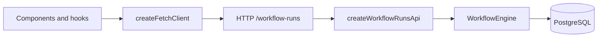

# @pg-workflows/ui

React components, hooks, and HTTP adapters for [pg-workflows](https://github.com/SokratisVidros/pg-workflows). Drop in the full dashboard, compose the pieces you need, or build your own UI on the hooks.


- [Quickstart](#quickstart)
- [Add it to your app](#add-it-to-your-app)
- [Components](#components)
- [Build a custom UI](#build-a-custom-ui)
- [API reference](#api-reference)

---

## Quickstart

```bash
npx @pg-workflows/ui
```

Open <http://127.0.0.1:3777>. That's it.

The dashboard connects to `postgres://localhost:5432/postgres`, the default local Postgres. Your app keeps running the workflows, and this process only reads runs and sends lifecycle actions (cancel, pause, resume, and so on). To use another database, pass `--database-url=<url>` or set `DATABASE_URL`. See [CLI](#cli) for all flags.

---

## Add it to your app

Three steps: install, mount the API, render a component. This example uses the Next.js App Router. Other servers are under [Server adapters](#server-adapters).

**1. Install**

```bash
npm install @pg-workflows/ui @tanstack/react-query pg-workflows pg
```

**2. Mount the API** with one catch-all route:

```ts
// app/workflow-runs/[[...path]]/route.ts
import { createAppRouterHandler } from '@pg-workflows/ui/next'
import { getEngine } from '@/lib/engine' // returns your WorkflowEngine singleton

export const { GET, POST } = createAppRouterHandler({ engine: getEngine })
```

**3. Add the styles** to your global CSS (Tailwind v4):

```css
@import 'tailwindcss';
@import '@pg-workflows/ui/styles.css';

@source '../node_modules/@pg-workflows/ui/dist';
```

Now render any [component](#components). A complete app lives in [`examples/dashboard`](../../examples/dashboard).

---

## Components

### `<WorkflowRunsDashboard/>`

The whole dashboard in one component: live toggle, status counts, filters, runs table, pagination, and run detail. It creates its own React Query client and provider.


```tsx
import { WorkflowRunsDashboard } from '@pg-workflows/ui'

export default function Page() {
  return <WorkflowRunsDashboard baseUrl="/workflow-runs" />
}
```

The components below render the same pieces one by one. They need a [`WorkflowRunsProvider`](#workflowrunsprovider) above them. [Build a custom UI](#build-a-custom-ui) shows the setup.

### `<RunsTable/>`

The list of runs, with step progress, ids, status, timestamps, and duration.


```tsx
const { serverParams } = useRunFilters()
const runs = useWorkflowRuns(serverParams)

<RunsTable
  runs={runs.data?.items ?? []}
  isLoading={runs.isLoading}
  onSelectRun={(id) => router.push(`/runs/${id}`)}
/>
```

### `<RunDetail/>`

One run: header, step timeline, input and output, and the lifecycle actions. It loads the run and calls the actions itself.


```tsx
<RunDetail runId={runId} onBack={() => router.back()} />
```

### `<StatusSummary/>`

A count per status. Click a count to filter by that status.


```tsx
const stats = useWorkflowRunStats()

<StatusSummary
  counts={stats.data ?? {}}
  onSelectStatus={(status) => setFilters({ statuses: [status] })}
/>
```

### `<FilterBar/>`

Search, plus status, workflow, date, and duration filters.


```tsx
const { filters, setFilters, clearFilters, hasActiveFilters } = useRunFilters()

<FilterBar
  filters={filters}
  hasActiveFilters={hasActiveFilters}
  workflowIds={['nightly-report', 'order-fulfillment']}
  onFiltersChange={(partial) => setFilters({ ...partial, startingAfter: undefined, endingBefore: undefined })}
  onClear={clearFilters}
/>
```

### `<Pagination/>`

Previous and next controls for the cursor-paginated list.


```tsx
<Pagination
  hasPrev={!!runs.data?.hasPrev}
  hasNext={!!runs.data?.hasMore}
  isFetching={runs.isFetching}
  onPrev={() => setFilters({ endingBefore: runs.data?.prevCursor ?? undefined, startingAfter: undefined })}
  onNext={() => setFilters({ startingAfter: runs.data?.nextCursor ?? undefined, endingBefore: undefined })}
/>
```

### `<LiveToggle/>`

A Live / Paused switch for polling. You own the state and pass the interval to the provider.


```tsx
const [live, setLive] = useState(true)

<LiveToggle isLive={live} isFetching={runs.isFetching} onToggle={() => setLive((v) => !v)} />
```

### `<StatusBadge/>`

A status label.


```tsx
<StatusBadge status={run.status} />
```

---

## Build a custom UI

Wrap your tree in `WorkflowRunsProvider` once. Every hook reads from it and returns plain [React Query](https://tanstack.com/query) results, so loading, error, and refetch states work the way you already know.

```tsx
'use client'
import { QueryClient, QueryClientProvider } from '@tanstack/react-query'
import { WorkflowRunsProvider, createFetchClient } from '@pg-workflows/ui'

const queryClient = new QueryClient()
const client = createFetchClient({ baseUrl: '/workflow-runs' })

export function Providers({ children }: { children: React.ReactNode }) {
  return (
    <QueryClientProvider client={queryClient}>
      <WorkflowRunsProvider client={client}>{children}</WorkflowRunsProvider>
    </QueryClientProvider>
  )
}
```

### `useWorkflowRuns()`: list runs

```tsx
const { data, isLoading } = useWorkflowRuns({ limit: 20, statuses: ['failed'] })

return (
  <ul>
    {data?.items.map((run) => (
      <li key={run.id}>{run.workflowId}: {run.status}</li>
    ))}
  </ul>
)
```

### `useWorkflowRun()`: one run

Polls until the run reaches a terminal status.

```tsx
const { data: run } = useWorkflowRun(runId)

return <p>{run?.workflowId} is {run?.status}</p>
```

### `useWorkflowRunStats()`: counts by status

```tsx
const { data: stats } = useWorkflowRunStats()

return <p>{stats?.failed ?? 0} failed, {stats?.running ?? 0} running</p>
```

### `useRunActions()`: control a run

```tsx
const { cancel, resume, trigger } = useRunActions()

<button onClick={() => resume.mutate({ id: runId })} disabled={resume.isPending}>Resume</button>
<button onClick={() => cancel.mutate({ id: runId })}>Cancel</button>
<button onClick={() => trigger.mutate({ id: runId, eventName: 'payment-confirmed', data: { ok: true } })}>
  Confirm payment
</button>
```

Lists and the run refresh on their own after each action.

### `useRunFilters()`: filter state

Holds the filter, sort, and cursor state. Pass `serverParams` straight to `useWorkflowRuns`.

```tsx
const { filters, setFilters, serverParams } = useRunFilters()
const runs = useWorkflowRuns(serverParams)

<select onChange={(e) => setFilters({ workflowId: e.target.value || undefined, startingAfter: undefined })}>
  <option value="">All workflows</option>
  <option value="nightly-report">nightly-report</option>
</select>
```

---

## API reference

- [Entry points](#entry-points)
- [CLI](#cli)
- Components: [`WorkflowRunsDashboard`](#workflowrunsdashboard-1) · [`RunsTable`](#runstable-1) · [`RunDetail`](#rundetail-1) · [`StatusSummary`](#statussummary-1) · [`FilterBar`](#filterbar-1) · [`Pagination`](#pagination-1) · [`LiveToggle`](#livetoggle-1) · [`StatusBadge`](#statusbadge-1)
- [`WorkflowRunsProvider`](#workflowrunsprovider)
- Hooks: [`useWorkflowRuns`](#useworkflowrunsparams) · [`useWorkflowRun`](#useworkflowrunid) · [`useWorkflowRunStats`](#useworkflowrunstatsparams) · [`useRunActions`](#userunactions) · [`useRunFilters`](#userunfiltersinitial) · [`useWorkflowRunsClient`](#useworkflowrunsclient)
- [Helpers](#helpers)
- [`createFetchClient`](#createfetchclientoptions)
- [Server adapters](#server-adapters)
- [HTTP API](#http-api)
- [Security](#security)
- [Styling & customization](#styling--customization)
- [Architecture](#architecture)

### Entry points

Client code never imports the server entries, so a browser bundle does not pull in the engine.

| Import | Contents | Runs |
|--------|----------|------|
| `@pg-workflows/ui` | Components, hooks, provider, helpers, and a re-export of the fetch client | client |
| `@pg-workflows/ui/client` | `createFetchClient` and types, no React | client or server |
| `@pg-workflows/ui/server` | `createWorkflowRunsApi`, `toFetchHandler`, `toNodeHandler` | server only |
| `@pg-workflows/ui/next` | `createAppRouterHandler`, `createPagesApiHandler`, `createRouteHandlers` | server only |
| `@pg-workflows/ui/tailwind` | Tailwind preset for the `pgw-*` color tokens | build |
| `@pg-workflows/ui/styles.css` | CSS variables (light and dark) and base styles | client |
| `pg-workflows-ui` (bin) | Standalone localhost dashboard | CLI |

Peer dependencies: `react >= 18`, `react-dom >= 18`, `@tanstack/react-query >= 5`, `tailwindcss ^4`, `pg-workflows >= 0.13.0`.

### CLI

```bash
npx @pg-workflows/ui [--database-url=<url>] [--port=3777]
```

| Flag | Default | Role |
|------|---------|------|
| `--database-url` | `DATABASE_URL`, else `postgres://localhost:5432/postgres` | Postgres connection string |
| `--port` | `3777` | Port to listen on |
| `-h`, `--help` | | Print usage |

The server binds to `127.0.0.1` only. It has no authentication and no `resolveContext`, so anyone who can reach the port can read and change every run. Do not expose it. It starts an engine with no registered workflows, which runs migrations if needed. It serves the API under `/workflow-runs` and the prebuilt dashboard everywhere else.

### Components

Every component takes `className`, `style`, and `render` (see [Styling & customization](#styling--customization)) and forwards a `ref` to its root element.

#### `WorkflowRunsDashboard`

Self-contained dashboard. It creates its own `QueryClient` (queries don't retry) and `WorkflowRunsProvider`. Pass exactly one of `baseUrl` or `client`.

| Prop | Type | Default | Description |
|------|------|---------|-------------|
| `baseUrl` | `string` | | Prefix of the mounted API routes. Mutually exclusive with `client`. |
| `client` | `WorkflowRunsClient` | | A client, usually from `createFetchClient`. Mutually exclusive with `baseUrl`. Read once on mount. |
| `pollIntervalMs` | `number` | `5000` while Live, `0` while paused | Refresh interval. When set, it replaces the Live control's interval: the button still toggles, but the interval stays fixed. |
| `selectedRunId` | `string \| null` | | Controlled selection. Pair with `onSelectRun` and your router for deep links. When omitted, the dashboard tracks selection itself. |
| `onSelectRun` | `(id: string \| null) => void` | | Called when a row is opened (`id`) or the detail view is closed (`null`). |

Style state: `{ selected: boolean }`.

#### `RunsTable`

| Prop | Type | Default | Description |
|------|------|---------|-------------|
| `runs` | `WorkflowRun[]` | | Rows to render, in order. |
| `onSelectRun` | `(id: string) => void` | | Called when a row is clicked. |
| `selectedRunId` | `string \| null` | | Highlights the matching row. |
| `isLoading` | `boolean` | `false` | While `runs` is empty, shows "Loading…" instead of "No runs". |

Columns: Workflow (with step progress when `totalSteps` is known), Run ID (copyable), Resource ID, Status, Started, Completed, Duration. Style state: `{ empty: boolean, loading: boolean }`.

#### `RunDetail`

Must render under `WorkflowRunsProvider`. It calls `useWorkflowRun(runId)` and `useRunActions()`.

| Prop | Type | Default | Description |
|------|------|---------|-------------|
| `runId` | `string` | | Run to load. |
| `onBack` | `() => void` | | Renders a back control that calls this. Omitted, there is no back control. |

Renders the header (workflow id, run id, resource, progress), a details grid (status, timestamps, duration, retries, priority, job, error), the Cancel / Pause / Resume / Fast-forward / Trigger actions (disabled once the run is terminal; Pause and Resume follow the current status), the step timeline, and input and output JSON. A failed run's error is shown above the steps. Style state: `{ phase: 'loading' | 'error' | 'ready', status?: string }`.

#### `StatusSummary`

| Prop | Type | Default | Description |
|------|------|---------|-------------|
| `counts` | `Partial<Record<WorkflowRunStatus, number>>` | | Counts by status, usually `useWorkflowRunStats().data`. |
| `onSelectStatus` | `(status: WorkflowRunStatus) => void` | | Called when a count is clicked. |
| `trailing` | `ReactNode` | | Rendered after the counts. |
| `stat` | `{ className?, style?, render? }` | | Style hooks for each count button. They receive that button's state. |

Renders one button per status whose count is above zero, and nothing when every count is `0`. Style state: `{ empty: boolean }`.

#### `FilterBar`

| Prop | Type | Description |
|------|------|-------------|
| `filters` | `RunFilters` | Current filters, from `useRunFilters`. |
| `hasActiveFilters` | `boolean` | Shows the Clear control. |
| `workflowIds` | `string[]` | Options for the workflow filter. |
| `onFiltersChange` | `(partial: Partial<RunFilters>) => void` | Called with the changed fields. Reset `startingAfter` and `endingBefore` here, or the next request stays on a cursor from the previous filter. |
| `onClear` | `() => void` | Called by the Clear control. |

Style state: `{ active: boolean }`.

#### `Pagination`

| Prop | Type | Default | Description |
|------|------|---------|-------------|
| `hasPrev` | `boolean` | | Enables Prev. |
| `hasNext` | `boolean` | | Enables Next. |
| `onPrev` | `() => void` | | |
| `onNext` | `() => void` | | |
| `isFetching` | `boolean` | `false` | Disables both buttons while a page loads. |

Style state: `{ hasPrev, hasNext, fetching }`.

#### `LiveToggle`

A Base UI `Toggle`.

| Prop | Type | Default | Description |
|------|------|---------|-------------|
| `isLive` | `boolean` | | Pressed state. |
| `isFetching` | `boolean` | | Sets `data-fetching` while a request is in flight. |
| `onToggle` | `() => void` | | Called on press. Pass `pollIntervalMs={isLive ? 5000 : 0}` to the provider. |
| `nativeButton` | `boolean` | `true` | Set to `false` when `render` is not a `<button>`. |

Style state: Base UI toggle state (`pressed`, `disabled`). Also sets `data-pressed` and `data-fetching`.

#### `StatusBadge`

| Prop | Type | Description |
|------|------|-------------|
| `status` | `WorkflowRunStatus` | `'pending' \| 'running' \| 'paused' \| 'completed' \| 'failed' \| 'cancelled'` |

Sets `data-status`. Style state: `{ status }`.

### `WorkflowRunsProvider`

| Prop | Type | Default | Description |
|------|------|---------|-------------|
| `client` | `WorkflowRunsClient` | | Used by every hook below. |
| `pollIntervalMs` | `number` | `5000` | Refresh interval for every query under the provider. `0` turns polling off. |
| `children` | `ReactNode` | | |

It must render inside a `QueryClientProvider`.

### Hooks

Every hook must run under `WorkflowRunsProvider`.

#### `useWorkflowRuns(params)`

List query. Returns `UseQueryResult<ListRunsResult>`.

| Param | Type | Description |
|-------|------|-------------|
| `limit` | `number` | Required. Page size. |
| `statuses` | `WorkflowRunStatus[]` | Filter by status. |
| `workflowId` | `string` | Filter by workflow. |
| `startingAfter` | `string` | Cursor for the next page. |
| `endingBefore` | `string` | Cursor for the previous page. |

`data` is `{ items, nextCursor, prevCursor, hasMore, hasPrev }`. The hook refetches while `pollIntervalMs > 0` and keeps the previous page on screen while the next one loads. Each item is a `WorkflowRun` from `pg-workflows`, plus `totalSteps?` when the workflow is registered on the server.

#### `useWorkflowRun(id)`

Single run. Returns `UseQueryResult<WorkflowRun>`. The query is disabled while `id` is empty. Polling stops once the status is terminal (`completed`, `failed`, or `cancelled`).

#### `useWorkflowRunStats(params?)`

Counts by status. Returns `UseQueryResult<Record<WorkflowRunStatus, number>>`. `params` is `{ workflowId?: string }`. Polls on the provider interval.

#### `useRunActions()`

Returns `{ cancel, pause, resume, fastForward, trigger }`. Each is its own `UseMutationResult<WorkflowRun>`, so `isPending` and `error` are per action. On success, the run and every runs list are invalidated.

| Action | Variables | Engine call |
|--------|-----------|-------------|
| `cancel` | `{ id }` | `cancelWorkflow` |
| `pause` | `{ id }` | `pauseWorkflow` |
| `resume` | `{ id }` | `resumeWorkflow` |
| `fastForward` | `{ id, data? }` | `fastForwardWorkflow`: completes the current wait step with `data` |
| `trigger` | `{ id, eventName, data? }` | `triggerEvent` |

#### `useRunFilters(initial?)`

Local filter state. `initial: Partial<RunFilters>` is merged over the defaults `{ limit: 20, sort: 'createdAt', dir: 'desc' }`.

`RunFilters`:

| Field | Type | Applied |
|-------|------|---------|
| `limit` | `number` | server |
| `startingAfter`, `endingBefore` | `string` | server |
| `statuses` | `WorkflowRunStatus[]` | server |
| `workflowId` | `string` | server |
| `search` | `string` | client (matches run id, workflow id, resource id) |
| `datePreset` | `'all' \| '1h' \| '24h' \| '7d' \| '30d' \| '90d'` | client |
| `durationPreset` | `'any' \| 'lt-10s' \| 'lt-30s' \| 'lt-1m' \| 'gt-30s' \| 'gt-1m' \| 'gt-5m' \| 'gt-10m'` | client |
| `sort` | `'id' \| 'workflowId' \| 'createdAt' \| 'status' \| 'duration'` | client |
| `dir` | `'asc' \| 'desc'` | client |

Client-side fields apply to the current page only, because the engine paginates by cursor.

Returns:

| Field | Description |
|-------|-------------|
| `filters` | The full `RunFilters` object. |
| `serverParams` | `{ limit, startingAfter, endingBefore, statuses, workflowId }`. Pass it to `useWorkflowRuns`. |
| `setFilters(partial)` | Merge a partial update. |
| `replaceFilters(next)` | Replace the whole object. |
| `clearFilters()` | Reset to the defaults. |
| `toggleSort(key)` | Sort by `key`. Calling it again on the same key flips `asc` / `desc`. |
| `hasActiveFilters` | `true` when status, workflow id, date, duration, or search is set. |

#### `useWorkflowRunsClient()`

Returns `{ client, pollIntervalMs }` from the provider. Throws outside `WorkflowRunsProvider`.

### Helpers

Exported from `@pg-workflows/ui`, and used by `<WorkflowRunsDashboard/>` to apply client-side filters:

```tsx
const rows = sortRuns(
  applyClientFilters(runs.data?.items ?? [], {
    search: filters.search,
    datePreset: filters.datePreset,
    durationPreset: filters.durationPreset,
  }),
  filters.sort,
  filters.dir,
)
```

| Export | Description |
|--------|-------------|
| `applyClientFilters(runs, { search?, datePreset?, durationPreset? })` | Filters a page of runs. |
| `sortRuns(runs, key, dir)` | Returns a sorted copy. |
| `computeDurationMs(run)` | Run duration in ms, or `null`. |
| `formatDuration(ms)` | `'1m 5s'` style string. |
| `timeAgo(date, now?)` | `'7m ago'` style string. |
| `isTerminalStatus(status)` | `true` for `completed`, `failed`, `cancelled`. |
| `DATE_PRESETS`, `DURATION_PRESETS` | `{ value, label }[]` option lists used by `FilterBar`. |
| `datePresetToFrom(preset, now?)` | ISO lower bound for a date preset. |
| `durationPresetToBounds(preset)` | `{ minDurationMs?, maxDurationMs? }` for a duration preset. |

### `createFetchClient(options)`

From `@pg-workflows/ui` or `@pg-workflows/ui/client` (no React). Returns a `WorkflowRunsClient` that talks to the [HTTP API](#http-api).

| Option | Type | Description |
|--------|------|-------------|
| `baseUrl` | `string` | Prefix of the mounted routes. |
| `fetch` | `typeof fetch` | Custom fetch, for example to add auth headers. Defaults to `globalThis.fetch`. |

```ts
interface WorkflowRunsClient {
  listRuns(params: ListRunsParams): Promise<ListRunsResult>
  getRun(id: string): Promise<WorkflowRun>
  getStats(params?: { workflowId?: string }): Promise<WorkflowRunStats>
  cancelRun(id: string): Promise<WorkflowRun>
  pauseRun(id: string): Promise<WorkflowRun>
  resumeRun(id: string): Promise<WorkflowRun>
  fastForwardRun(id: string, body?: { data?: Record<string, unknown> }): Promise<WorkflowRun>
  triggerEvent(id: string, body: { eventName: string; data?: Record<string, unknown> }): Promise<WorkflowRun>
}
```

Any non-2xx response throws. Implement the interface yourself to back the components with something other than HTTP.

### Server adapters

| Export | From | Description |
|--------|------|-------------|
| `createWorkflowRunsApi({ engine, basePath?, resolveContext? })` | `/server` | Builds `{ fetch(request): Promise<Response> }`. `basePath` defaults to `/workflow-runs`. `resolveContext(req)` returns `{ resourceId? }` or throws (see [Security](#security)). |
| `toFetchHandler(api)` | `/server` | Normalizes the api, or a `(request) => Response` wrapper, to one Fetch function. |
| `toNodeHandler(api)` | `/server` | Node `(req, res)` adapter for Express, Fastify (`req.raw` / `reply.raw`), Nest, or `node:http`. |
| `createAppRouterHandler({ engine, basePath?, resolveContext? })` | `/next` | `{ GET, POST }` for an App Router catch-all. `engine` may be an engine or a getter (`getEngine`). The first request awaits `engine.start()` and builds the API once. It also accepts an existing API or fetch function. |
| `createPagesApiHandler({ engine, basePath? })` | `/next` | Default export for a Pages Router catch-all. Same engine startup. |
| `createRouteHandlers({ engine })` | `/next` | One Fetch handler per endpoint (`list`, `detail`, `cancel`, `pause`, `resume`, `fastForward`, `trigger`), for a file per route. Use it to wrap mutations in extra auth. |

The adapters speak Web `Request` / `Response` and send no CORS headers. Serve the dashboard and the API from the same origin, for example with a Vite dev-server proxy.

#### Next.js App Router

Keep one engine per process:

```ts
// lib/engine.ts
import { WorkflowEngine } from 'pg-workflows'
import { sendWelcome } from './workflows'

const globalForEngine = globalThis as unknown as { engine?: WorkflowEngine }

export function getEngine() {
  if (!globalForEngine.engine) {
    const connectionString = process.env.DATABASE_URL
    if (!connectionString) throw new Error('DATABASE_URL is not set')
    globalForEngine.engine = new WorkflowEngine({ connectionString, workflows: [sendWelcome] })
  }
  return globalForEngine.engine
}
```

```ts
// app/workflow-runs/[[...path]]/route.ts
import { createAppRouterHandler } from '@pg-workflows/ui/next'
import { getEngine } from '@/lib/engine'

// Pass `getEngine` itself, not `getEngine()`: the handler calls it on the first request.
export const { GET, POST } = createAppRouterHandler({ engine: getEngine })
```

`<WorkflowRunsDashboard/>` can be imported from a Server Component. The components carry their own `'use client'` directives.

#### Next.js Pages Router

`basePath` is the public URL Next puts on the request:

```ts
// pages/api/workflow-runs/[[...path]].ts
import { createPagesApiHandler } from '@pg-workflows/ui/next'
import { getEngine } from '@/lib/engine'

export default createPagesApiHandler({ engine: getEngine, basePath: '/api/workflow-runs' })
```

```tsx
<WorkflowRunsDashboard baseUrl="/api/workflow-runs" />
```

#### Express

```ts
import express from 'express'
import { createWorkflowRunsApi, toNodeHandler } from '@pg-workflows/ui/server'
import { engine } from './engine'

const runsApi = createWorkflowRunsApi({ engine, basePath: '/workflow-runs' })

const app = express()
app.use('/workflow-runs', toNodeHandler(runsApi))
```

`basePath` must match the mount. `toNodeHandler` reads `req.originalUrl`, which keeps the prefix that Express strips from `req.url`. Don't run `express.json()` on this path, because it consumes the body before the handler can read it.

#### Hono

```ts
app.all('/workflow-runs', (c) => runsApi.fetch(c.req.raw))
app.all('/workflow-runs/*', (c) => runsApi.fetch(c.req.raw))
```

#### TanStack Start

The list path and the splat are separate files. `/workflow-runs/$` does not match `GET /workflow-runs`.

```ts
// src/routes/workflow-runs.index.ts
export const Route = createFileRoute('/workflow-runs')({
  server: { handlers: { GET: ({ request }) => runsApi.fetch(request) } },
})

// src/routes/workflow-runs/$.ts
const handle = ({ request }: { request: Request }) => runsApi.fetch(request)
export const Route = createFileRoute('/workflow-runs/$')({
  server: { handlers: { GET: handle, POST: handle } },
})
```

#### Bun and Deno

```ts
Bun.serve({ fetch: (request) => runsApi.fetch(request) })
Deno.serve((request) => runsApi.fetch(request))
```

Requests outside `basePath` get a `404` from the adapter.

### HTTP API

All paths are under `basePath` (default `/workflow-runs`).

| Method and path | Engine call |
|-----------------|-------------|
| `GET /` | `getRuns` (query: `starting_after`, `ending_before`, `limit`, `workflow_id`, `statuses`) |
| `GET /stats` | `getStats` (query: `workflow_id`) |
| `GET /:id` | `getRun` |
| `POST /:id/cancel` | `cancelWorkflow` |
| `POST /:id/pause` | `pauseWorkflow` |
| `POST /:id/resume` | `resumeWorkflow` |
| `POST /:id/fast-forward` | `fastForwardWorkflow` (body: `{ data? }`) |
| `POST /:id/trigger` | `triggerEvent` (body: `{ eventName, data? }`) |

Status codes: `400` validation, `401` `resolveContext` threw, `404` unknown run or path, `405` method not allowed, `409` illegal transition or `WorkflowRunInProgressError`, `500` anything else.

### Security

The adapter leaves authentication to your app, so put the routes behind your own middleware.

For scoping, use `resolveContext`. The `resourceId` it returns is passed to every read and every action, so a caller only sees and changes their own runs. `resourceId` is never read from the client.

```ts
createWorkflowRunsApi({
  engine,
  resolveContext: (req) => ({ resourceId: getTenantFromSession(req) }), // throw → 401
})
```

> **Open by default.** Without `resolveContext`, the adapter exposes and changes every run in the database. That's fine for a single-tenant dashboard behind your auth. Pass `resolveContext` when several tenants share the database.

### Styling & customization

The components are [Base UI](https://base-ui.com/react/components) parts with a default theme: square corners, a 1px ink border, neutral surfaces, and a hard offset shadow. Status color is the only chroma.

- `className` and `style` take a value, or a function of the component's state (listed with each component above).
- `render` replaces the root element instead of wrapping it. The part's props and behavior move to the element you pass.
- State is also written as `data-*` attributes, so plain CSS can target it.
- Style the public root and documented parts (`stat` on `StatusSummary`). Markup inside a part may change between releases.

**Recolor with CSS variables.** Override any `--pgw-*` token on `:root` or a closer scope:

```css
:root {
  --pgw-accent: #6d28d9;
  --pgw-accent-fg: #fff;
  --pgw-border: #e5e5e5;
  --pgw-radius: 0.5rem;
  --pgw-font: "IBM Plex Sans", sans-serif;
  --pgw-focus: #6d28d9;
  --pgw-status-running: #2563eb;
  /* also: --pgw-bg, --pgw-fg, --pgw-card, --pgw-muted, --pgw-muted-fg,
     --pgw-hover, --pgw-active, --pgw-disabled, --pgw-shadow, --pgw-on-status,
     --pgw-status-completed, --pgw-status-failed, --pgw-status-paused,
     --pgw-status-cancelled, --pgw-status-pending */
}
```

Dark mode follows `prefers-color-scheme`. There is no toggle yet.

**Restyle one component** with the style hooks:

```tsx
<StatusBadge
  status={run.status}
  className={(state) => (state.status === 'failed' ? 'ring-2 ring-red-600' : undefined)}
/>

<StatusSummary counts={counts} stat={{ className: 'uppercase tracking-wide' }} />
```

```css
.pgw-badge[data-status='failed'] { color: #b91c1c; }
.pgw-live[data-pressed] { border-color: var(--pgw-status-running); }
```

**Use the tokens in your own markup.** `styles.css` registers them with Tailwind v4 `@theme`: `bg-pgw-bg`, `text-pgw-fg`, `border-pgw-border`, `text-pgw-status-running`, `shadow-pgw`, `font-pgw`, and more.

```tsx
<span className="bg-pgw-status-running px-2 text-pgw-on-status">running</span>
```

Add `pgw-root` to your container when you compose the pieces yourself. It sets the background, foreground, and font. `<WorkflowRunsDashboard/>` already applies it. The stable classes `.pgw-button`, `.pgw-badge`, `.pgw-input`, `.pgw-popup`, `.pgw-filters`, `.pgw-stat`, and `.pgw-live` live in `@layer components`, so your utilities override them.

With a JS Tailwind config instead of `@source`, add the preset and the package to `content`. The preset adds only the color tokens, not `shadow-pgw` or `font-pgw`.

```ts
import pgwPreset from '@pg-workflows/ui/tailwind'

export default {
  presets: [pgwPreset],
  content: ['./node_modules/@pg-workflows/ui/dist/**/*.js'],
}
```

### Architecture


```mermaid
flowchart LR
  UI["Components and hooks"] --> Client["createFetchClient"]
  Client --> HTTP["HTTP /workflow-runs"]
  HTTP --> API["createWorkflowRunsApi"]
  API --> Engine["WorkflowEngine"]
  Engine --> DB[("PostgreSQL")]
```

The browser calls the hooks, the hooks call HTTP, and the server adapter calls `WorkflowEngine`. Postgres stays on the server.

## License

MIT
